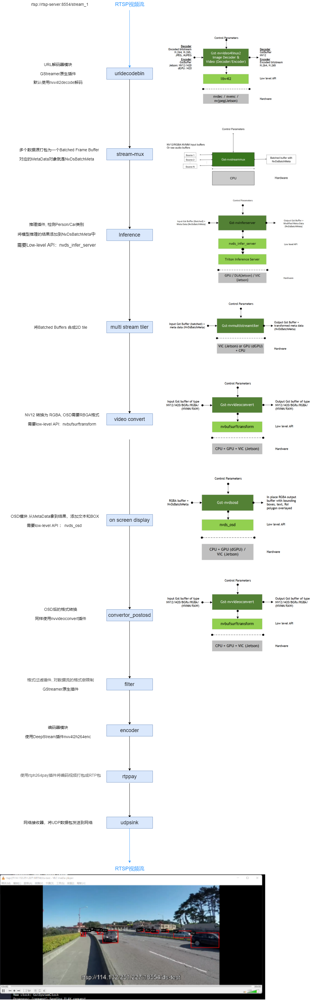
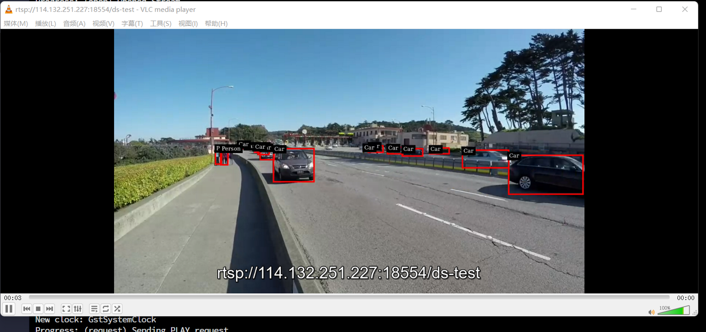

# DeepStream Cloud Demo
这是一个DeepStream在云端场景的Demo, 输入和输出均为RTSP视频流

## 环境部署
`docker-compose -f deepstream.yml -p deepstream up -d`  

以下所有操作都在deepstream容器内完成

## 发起视频流
这里模拟云端场景的RTSP视频流输入  
`ffmpeg -re -stream_loop -1 -i /opt/nvidia/deepstream/deepstream/samples/streams/sample_720p.mp4 -c copy -f rtsp 
 rtsp://rtsp-server:8554/stream_1`

## 启动DeepStream APP
`cd /opt/nvidia/deepstream/deepstream/deepstream_python_apps/apps/deepstream-rtsp-in-rtsp-out && 
 python3 deepstream_test1_rtsp_in_rtsp_out.py -i rtsp://rtsp-server:8554/stream_1 -g nvinferserver`

DeepStream应用的输出也是一个RTSP视频流，在宿主机下的地址为 `rtsp://127.0.0.1:18554/ds-test`  
使用FRP反代转发18554端口到公网服务器

## 播放输出视频流
使用VLC播放器播放视频流

